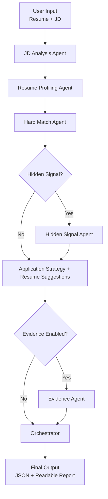

# Technical Workflow (Flowchart + I/O Contracts + Example)

This is the technical workflow reference for engineers.

For the non-technical version, see `docs/architecture/workflow_non_technical.md`.

## 1) End-to-End Flow

1. Receive `job_description` and `resume`.
2. Validate input quality and minimum completeness.
3. Parse job requirements with JD Analysis.
4. Build candidate profile with Resume Profiling.
5. Compute objective fit with Hard Match.
6. Optionally run:
   - Hidden Signal analysis,
   - Evidence Citation mapping.
7. Orchestrator merges all signals and applies decision rules.
8. Produce decision (`Apply` / `Edge Apply` / `No Apply`) and recommendations.
9. Return schema-aligned output.

## 2) Agent-by-Agent Execution

### Step 1: JD Parsing (Required)

**Agent:** JD Analysis Agent

- Extract required skills, preferred skills, responsibilities, and seniority signals.
- Output: structured JD signals (JSON).

### Step 2: Resume Profiling (Required)

**Agent:** Resume Profiling Agent

- Convert resume text into structured profile (skills, experience, projects, domain).
- Output: candidate profile (JSON).

### Step 3: Hard Matching (Required)

**Agent:** Hard Match Agent

- Compute objective alignment between JD and candidate profile.
- Output: match score, strengths, and critical gaps.

### Step 4: Hidden Signal Interpretation (Optional, Recommended)

**Agent:** Hidden Signal Agent

- Infer implicit expectations (ownership, ambiguity tolerance, true seniority).
- Output: hidden risk signals.

### Step 5: Application Strategy (Required)

**Agent:** Application Strategy Agent

- Combine hard-match signals and optional hidden signals.
- Output: decision + rationale + resume change suggestions.

### Step 6: Evidence Mapping (Optional, Recommended)

**Agent:** Evidence Citation Agent

- Map major claims to JD and resume evidence.
- Output: claim-to-evidence mappings.

### Step 7: Orchestration and Finalization (Required)

**Agent:** Orchestrator Agent

- Resolve cross-agent conflicts and enforce schema consistency.
- Produce canonical JSON output and human-readable report.

## 3) Workflow Flowchart

```text
User Input (Resume + JD)
        |
        v
+--------------------+
| JD Analysis Agent  |
+--------------------+
        |
        v
+------------------------+
| Resume Profiling Agent |
+------------------------+
        |
        v
+------------------+
| Hard Match Agent |
+------------------+
        |
        v
[Hidden Signal?] --Yes--> Hidden Signal Agent
        | No
        v
+---------------------------+
| Application Strategy      |
| + Resume Suggestions      |
+---------------------------+
        |
        v
[Evidence Enabled?] --Yes--> Evidence Agent
        | No
        v
+------------------+
| Orchestrator     |
+------------------+
        |
        v
Final Output (JSON + Readable Report)
```



## 4) Input Contract (Required vs Optional)

### Required Input

- `job_description` (string)
- `resume` (string)

### Optional Input

- `preferences.output_mode` (`decision_only` | `decision_plus_suggestions`)
- `preferences.target_seniority` (string)
- `preferences.industry_focus` (string)
- `preferences.include_hidden_signal` (boolean)
- `preferences.include_evidence_mapping` (boolean)

### Example Input

```json
{
  "job_description": "Senior Data Analyst role requiring SQL, stakeholder communication, and dashboard ownership.",
  "resume": "Data Analyst with 5 years experience. Built dashboards in Tableau, led reporting automation, collaborated with product teams.",
  "preferences": {
    "output_mode": "decision_plus_suggestions",
    "target_seniority": "senior",
    "industry_focus": "SaaS",
    "include_hidden_signal": true,
    "include_evidence_mapping": true
  }
}
```

## 5) Output Contract (Required vs Optional)

### Required Output

- `version` (string)
- `request_id` (string)
- `decision` (`Apply` | `Edge Apply` | `No Apply`)
- `overall_score` (0-100)
- `category_scores` (array)
- `strengths` (array)
- `gaps` (array)
- `recommendations` (array)
- `metadata` (object)

### Optional Output

- `hidden_signals` (array)
- `evidence_map` (array/object)
- `warnings` (array)

### Example Output

```json
{
  "version": "1.0.0",
  "request_id": "req_2026_02_25_001",
  "decision": "Edge Apply",
  "overall_score": 74
}
```

## 6) Notes

- Optional agents can be skipped while keeping output schema-valid.
- Final contract should align with `docs/architecture/output_schema.md`.
