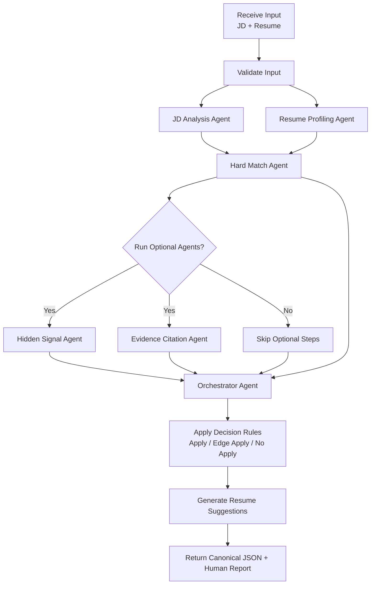

# Technical Workflow Guide (Flowchart + I/O Contracts + Example)

This is the technical workflow document.
It explains the end-to-end flow, includes a flowchart, and defines concrete input/output examples with required vs optional fields.

For a non-technical version, see `docs/architecture/workflow_non_technical.md`.

## 1) Workflow in Plain English

1. The system receives a job description and a resume.
2. It validates basic input quality (non-empty text, expected length, parsable format).
3. It parses the job description into structured requirements.
4. It profiles the resume into structured candidate signals.
5. It computes hard matching (skills, experience, and role-fit score).
6. It may run optional analysis:
   - hidden expectations from the job description,
   - evidence mapping for explainability.
7. It combines all results in the orchestrator.
8. It applies decision rules to produce:
   - `Apply`, `Edge Apply`, or `No Apply`.
9. It generates targeted resume improvement suggestions.
10. It returns standardized JSON output for both machine and human use.

## 2) Workflow Flowchart



## 3) Input Contract (Required vs Optional)

### Required Input

- `job_description` (string)
- `resume` (string)

### Optional Input

- `preferences.output_mode` (`decision_only` | `decision_plus_suggestions`)
- `preferences.target_seniority` (string, for example `mid`, `senior`)
- `preferences.industry_focus` (string)
- `preferences.include_hidden_signal` (boolean)
- `preferences.include_evidence_mapping` (boolean)

### Example Input

```json
{
  "job_description": "Senior Data Analyst role requiring SQL, stakeholder communication, and dashboard ownership.",
  "resume": "Data Analyst with 5 years experience. Built dashboards in Tableau, led reporting automation, collaborated with product teams.",
  "preferences": {
    "output_mode": "decision_plus_suggestions",
    "target_seniority": "senior",
    "industry_focus": "SaaS",
    "include_hidden_signal": true,
    "include_evidence_mapping": true
  }
}
```

## 4) Output Contract (Required vs Optional)

### Required Output

- `version` (string)
- `request_id` (string)
- `decision` (`Apply` | `Edge Apply` | `No Apply`)
- `overall_score` (0-100)
- `category_scores` (array)
- `strengths` (array)
- `gaps` (array)
- `recommendations` (array)
- `metadata` (object)

### Optional Output

- `hidden_signals` (array) - present when hidden-signal analysis is enabled
- `evidence_map` (array/object) - present when evidence mapping is enabled
- `warnings` (array) - present when inputs are partial or confidence is low

### Example Output

```json
{
  "version": "1.0.0",
  "request_id": "req_2026_02_25_001",
  "decision": "Edge Apply",
  "overall_score": 74,
  "category_scores": [
    { "category": "skills", "score": 80, "weight": 0.35, "confidence": 0.88 },
    { "category": "experience", "score": 72, "weight": 0.35, "confidence": 0.84 },
    { "category": "impact", "score": 68, "weight": 0.30, "confidence": 0.79 }
  ],
  "strengths": [
    "Strong SQL and dashboard ownership alignment",
    "Relevant cross-functional stakeholder collaboration"
  ],
  "gaps": [
    "No explicit dbt/Airflow evidence",
    "Limited quantified business impact in resume bullets"
  ],
  "recommendations": [
    {
      "priority": 1,
      "action": "Add one bullet with measurable business outcome from dashboard work",
      "expected_impact": "high",
      "rationale": "Role emphasizes ownership and measurable impact"
    },
    {
      "priority": 2,
      "action": "Add a short skills line covering data pipeline tools (if applicable)",
      "expected_impact": "medium",
      "rationale": "Improves visible alignment with platform/tool expectations"
    }
  ],
  "hidden_signals": [
    "Role likely expects senior-level ownership under ambiguity"
  ],
  "evidence_map": [
    {
      "claim": "Strong SQL fit",
      "jd_evidence": "Role requiring SQL",
      "resume_evidence": "Built dashboards in Tableau and led reporting automation"
    }
  ],
  "metadata": {
    "include_hidden_signal": true,
    "include_evidence_mapping": true,
    "orchestrator_confidence": 0.83
  }
}
```

## 5) Notes

- If optional agents are disabled, output remains schema-valid and simply omits optional sections.
- For canonical field definitions, align with `docs/architecture/output_schema.md`.
